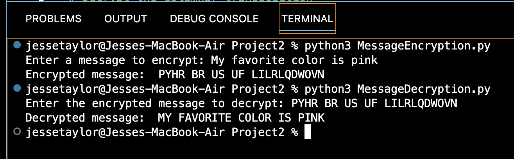
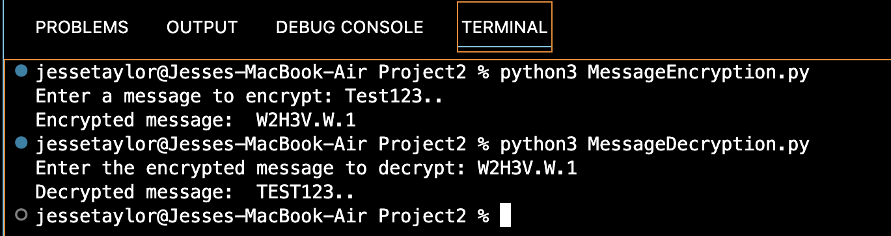

Portfolio
=========

Programming Projects
--------------------

*For access to my private project repositories, please [email me](mailto:example@JMTaylor2@csustudent.net?subject=GitHub%20Access) with the subject line, GitHub Access.

---
### [Project 1: Bible Lookup | CSCI 325](project1)

---
### [Project 2: Encryption & Decryption | CSCI 452](project2)

---
### [Project 3: Data Analysis & Visualization | CSCI 409](project3)

---
### [Project 4 Title | CSCI 332](project1)

---

Ethics Papers
-------------

### [Paper 1: An Ethical Dilemma in Cybersecurity](/pdf/CSCI_235_Paper.pdf)

-   **Class:** CSCI 235: Object-Oriented Programming
-   **Grade:** A

### [Paper 2: Edward Snowden: Justified or Not?](/pdf/CSCI_405_Paper.pdf)

-   **Class:** CSCI 405: Principals of Cybersecurity
-   **Grade:** A

### [Paper 3: Ethics In Programming](/pdf/CSCI_332_Paper.pdf)

-   **Class:** CSCI 332: Applied Networking
-   **Grade:** A

---

Presentations
-------------

### [Presentation 1: SolarWinds TED Talk](/pdf/CSCI_352_Presentation.pdf)

- **Class:** CSCI 352: Cyber Defense
- **Grade:** A

### [Presentation 2: Data Analysis & Visualization](/pdf/CSCI_409_Presentation.pdf)

- **Class:** CSCI 409: Fundamentals of Artificial Intelligence
- **Grade:** A

### [Presentation 3: Hackable Medical Devices](/pdf/HackableMedicalDevices.pdf)

- **Class:** CSCI 301: Survey of Scripting Languages
- **Grade:** A

---

Page template forked from <a href="https://github.com/csu-cs/csci-portfolio">CSU-CS</a>

<!-- Remove above link if you don't want to attributive -->
