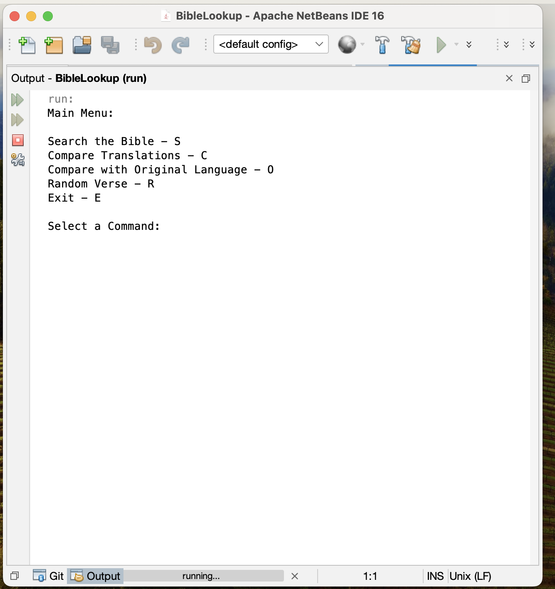
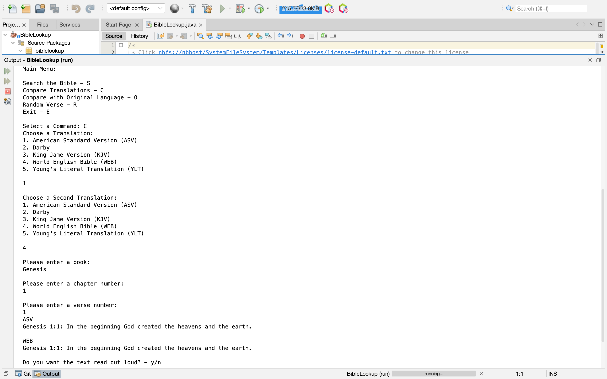
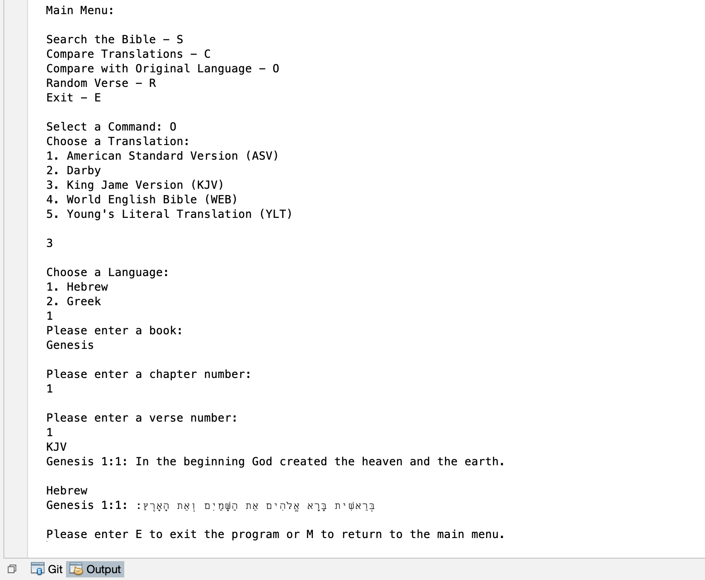
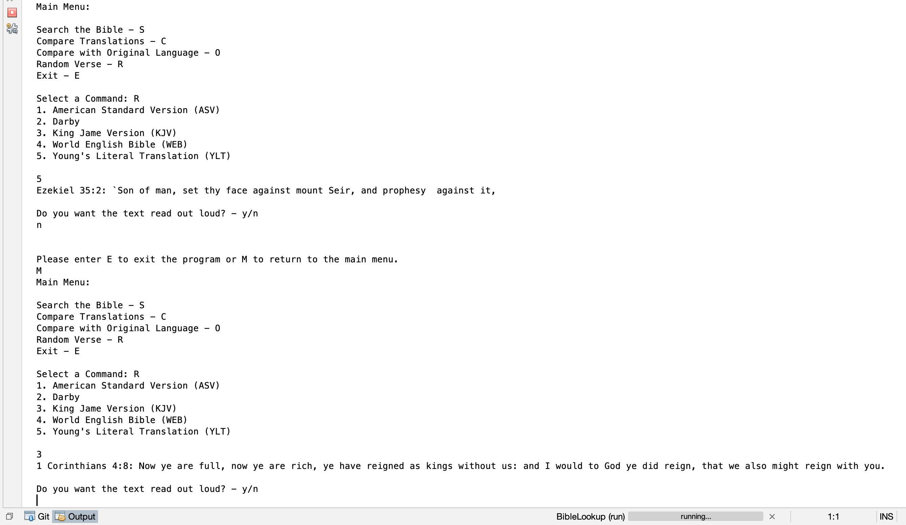

[Back to Portfolio](./)

Project 2: Message Encryption/Decryption
===============

-   **Class:** CSCI 452
-   **Grade:** A
-   **Language(s):** Python
-   **Source Code Repository:** [features/mastering-markdown](https://github.com/JessicaTaylor7/Projects/tree/main/BibleLookup)  
    (Please [email me](mailto:JMTaylor2@csustudent.net?subject=GitHub%20Access) to request access.)

## Project description

This program is a group project for CSCI 325: Object-Oriented Programming. The project authors include myself, Jacob Hamacher, Bryson Resh, Orion Crosby. My role in this project was creation of the random verse functionality and incorporation of the various classes into the main class. This program allows users to search the Bible, compare Bible translations, compare Bible text with original language, and generate a random Bible verse. This program also offers users a text-to-speech option, implemented using open source software outlined in the project source code. The program source code is split into separate classes for each feature. Inheritance is used when applicable to eliminate code redundancy. Each class is then incoporated into a main class, which includes the main menu and allows the individual classes/features to run as a single program. 

## How to run the program

The project was built and tested in the Apache NetBeans IDE 16 environment. It is recommended to use this platform when running the program. To do this, install Apache NetBeans IDE (if not already installed). Next, download the project file and then upload the project file into NetBeans. In the left panel, under 'Projects', select 'BibleLookup'. Then, under Source Packages > biblelookup, select 'BibleLookup.java'. To run the program, click on the green arrow in the top toolbar. A message may appear that reads "The project BibleLookup uses build.properties from another NetBeans installation." - select 'Build Anyway'. The program should start. 

## UI Design

The user interacts with this program through the command line. When the program is started, the user will see the main menu (see Fig 1), which prompts the user to select their desired functionality. The program features include Search the Bible (S or s), Compare Translations (C or c), Compare with Original Language (O or o), Random Verse (R or r), and Exit (E or e). 

Search the Bible (see Fig 2) will first prompt the user to select a translation (Darby, ASV, KJV, WEB, YLT). Next, the user will be prompted to enter a book of the Bible (ex. Genesis). Lastly, the program will prompt the user to enter a chapter and verse number. The user also has the option to search for an entire chapter if they do not wish to display a particular verse. The user's selection will display with the book, chapter, verse, and translations. The user can chose to have the text read aloud by selecting y/n. By selecting 'E' or 'e' the user can exit the program and 'M' or 'm' to return back to main menu.

Compare Translations (see Fig 3) will prompt the user to select their first desired translation (Darby, ASV, KJV, WEB, YLT), followed by their second desired translation (Darby, ASV, KJV, WEB, YLT). Next, they will be asked to enter a book of the Bible (ex. Genesis), followed by a chapter and verse number. The program will display the chosen translation/book/chapter/verse in the first translation followed by the same translation/book/chapter/verse in the second translation. The user can chose to have the text read aloud by selected y/n. By selecting 'E' or 'e' the user can exit the program and 'M' or 'm' to return back to main menu.

Compare with Original Language (see Fig 4) will prompt the user to select a language (Hebrew or Greek). Next, they will be asked to enter a book of the Bible (ex. Genesis), followed by a chapter and verse number. The program will display the chosen book/chapter/verse in the English language followed by the same book/chapter/verse in the chosen original language (Hebrew or Greek). By selecting 'E' or 'e' the user can exit the program and 'M' or 'm' to return back to main menu.

Random Verse (see Fig 5) will prompt the user to select their desired translation (Darby, ASV, KJV, WEB, YLT). A random verse will be displayed in the chosen translation and the user can chose to have the text read aloud by selected y/n. By selecting 'E' or 'e' the user can exit the program and 'M' or 'm' to return back to main menu.

  
Fig 1. The main menu

  
Fig 2. The search feature

  
Fig 3. The compare translations feature

  
Fig 4. The compare with original language feature

  
Fig 5. The random verse feature

[Back to Portfolio](./)
