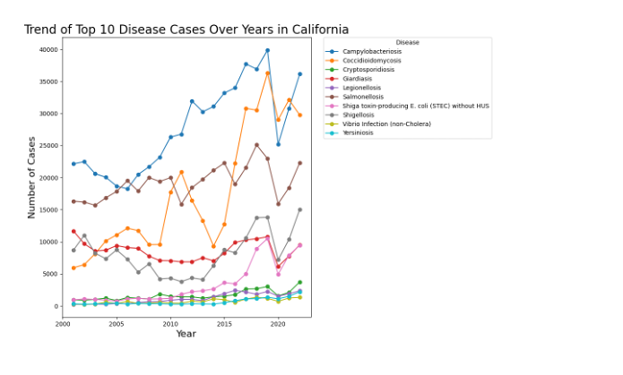
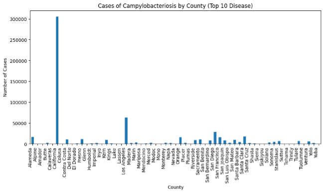
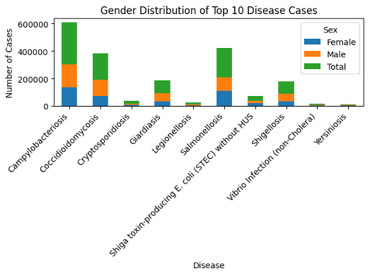

[Back to Portfolio](./)

Project 3: Data Analysis & Visualization
===============

-   **Class:** CSCI 409
-   **Grade:** A
-   **Language(s):** Python
-   **Source Code Repository:** [features/mastering-markdown](https://github.com/JessicaTaylor7/Data-Analysis-Visualization)  
    (Please [email me](mailto:JMTaylor2@csustudent.net?subject=GitHub%20Access) to request access.)

## Project description

This program is a project for CSCI 409: Fundamentals of Artificial Intelligence. This program allows for visualization of data from a specific data set. The data set used in this project focuses on infectious diseases in California from 2001 to 2023. The data is grouped by disease, county, number of cases (female, male, total), year, population, rate, lower 95 CI, upper 95 CI. For this program, I chose three angles to represent the data: 

1.	Focusing on the top 10 most prevalent diseases, show case numbers for each disease over years (2001 to 2023)
2.	Show total case numbers of a specific top 10 disease in each county
3.	Focusing on the top 10 most prevalent diseases, show total number of cases for female, male, and both genders

For this program, I used pandas and matplotlib libraries in Python to sort through the data set, make calculations, and create charts/graphs for visualization of the data. 

## How to run the program

The project was built and tested in the Visual Studio Code environment using Python 3. To run the program using the terminal and Python 3, first change the directory to the directory in which the program files are stored. 

To run the program: python3 project3.py

The program will generate three charts/graphs, one for each angle of data representation. 

## UI Design

The user interacts with this program through the command line. When the program begins, it will generate three charts/graphs, one for each angle of data representation.

Figure 1 shows a line graph representing the top 10 most prevalent diseases, showing case numbers for each disease over years (2001 to 2023)

Figure 2 shows a bar graph representing total case numbers of a specific top 10 disease in each county

Figure 3 shows a bar graph representing the top 10 most prevalent diseases, showing total number of cases for female, male, and both genders

Fig 1. Angle One

  
Fig 2. Angle Two

  
Fig 3. Angle Three

## Additional Information

### [Presentation: Data Analysis & Visualization](/pdf/CSCI_409_Presentation.pdf)

### [Report: Data Analysis & Visualization](/pdf/Project03_Report.pdf)

[Back to Portfolio](./)
