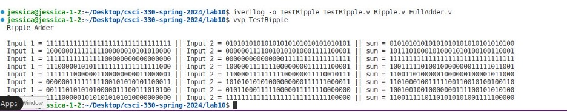
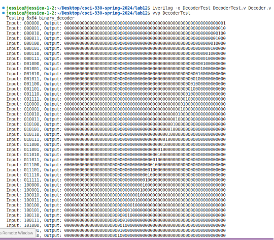
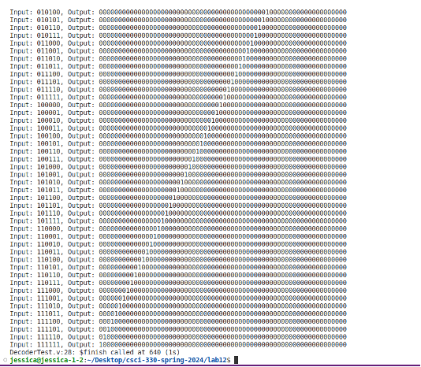

[Back to Portfolio](./)

Project 4: Processor Components
===============

-   **Class:** CSCI 330
-   **Grade:** B
-   **Language(s):** Verilog
-   **Source Code Repository:** [features/mastering-markdown](https://github.com/JessicaTaylor7/Projects/tree/main/ProcessorComponents)  
    (Please [email me](mailto:JMTaylor2@csustudent.net?subject=GitHub%20Access) to request access.)

## Project description

This is project for CSCI 330: Computer Architecture. The goal for this project is to create the various components of a single cycle processor using the Verilog language. The components include a ripple carry adder, 32-bit register file, instruction memory module, data memory module, and control ROM.  

## How to run the program

The components for this project are written in Verilog and require an environment that can run Verilog programs. Some of the components will not produce output, but the two components that will produce output are the ripple carry adder and control ROM. Both components have a main file and test file. To run the program, first ensure that the terminal directory is set to where the program files are stored. 

To compile and run the ripple carry adder: 

**Compile:** iverilog -o TestRipple TestRipple.v Ripple.v FullAdder.v

**Run:** vvp TestRipple

To compile and run the control ROM: 

**Compile:** iverilog -o DecoderTest DecoderTest.v Decoder.v

**Run:** vvp DecoderTest

## UI Design

The user interacts with this program through the command line. 

Figure 1 shows the output for eight ripple carry adder tests

Figures 2 and 3 show the test output for a 6x64 binary decoder (control ROM)

Fig 1. Ripple Carrry Adder

  
Fig 2. 6x64 Binary Decoder

  
Fig 3. 6x64 Binary Decoder

## Additional Information

### [Report: Single Cycle Processor Components](/pdf/Project04_Report.pdf)

[Back to Portfolio](./)

