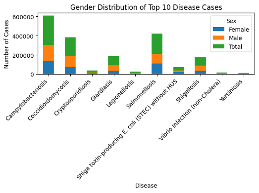

[Back to Portfolio](./)

Project 4: Processor Components
===============

-   **Class:** CSCI 330
-   **Grade:** B
-   **Language(s):** Verilog
-   **Source Code Repository:** [features/mastering-markdown](https://github.com/JessicaTaylor7/Projects/tree/main/ProcessorComponents)  
    (Please [email me](mailto:JMTaylor2@csustudent.net?subject=GitHub%20Access) to request access.)

## Project description

This is project for CSCI 330: Computer Architecture. The goal for this project is to create the various components of a single cycle processor using the Verilog language. The components include a ripple carry adder, 32-bit register file, instruction memory module, data memory module, and control ROM.  

## How to run the program

The components for this project are written in Verilog and require an environment that can run Verilog programs. Some of the components will not produce output, but the two components that will produce output are the ripple carry adder and control ROM. These two components include a main file and test file. 

## UI Design

The user interacts with this program through the command line. When the program begins, it will generate three charts/graphs, one for each angle of data representation.

Figure 1 shows a line graph representing the top 10 most prevalent diseases, showing case numbers for each disease over years (2001 to 2023)

Figure 2 shows a bar graph representing total case numbers of a specific top 10 disease in each county

Figure 3 shows a bar graph representing the top 10 most prevalent diseases, showing total number of cases for female, male, and both genders

Fig 1. Angle One

  
Fig 2. Angle Two

  
Fig 3. Angle Three

## Additional Information

### [Report: Data Analysis & Visualization](/pdf/Project03_Report.pdf)

[Back to Portfolio](./)

